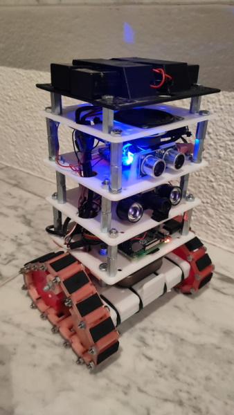
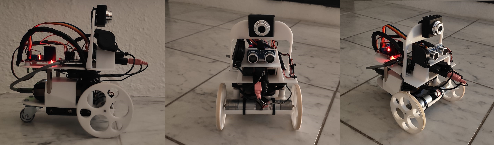

# PiBot_v3

A robot project :)



older version:


## Installation

- sudo apt-get install libportaudio-dev
- curl get.pimoroni.com/skywriter | bash
- sudo apt-get install flac
- pip3 install PyAudio
- sudo apt-get install libportaudio0 libportaudio2 libportaudiocpp0 portaudio19-dev
- pip3 install SpeechRecognition
- sudo apt-get install mpg321
- sudo apt-get update && sudo apt-get install espeak
- Activate l2c interface on raspberry (using raspi-config)

## Disable internal broadcom sound card 

In order to have the usb audio as default audio device it makes sense to disable the  
internal broadcom sound card, since sometimes it can happen, that at boot time , the usb  
audio is added as card0 or card1 etc., so that it hast to be adapted in alsa.conf everytime it changes.  
```shell
# Edit boot config with:
sudo nano /boot/config.txt
# so that:
cat /boot/config.txt
...
# Enable audio (loads snd_bcm2835)
#dtparam=audio=on
dtparam=audio=off
...
# You need to reboot!
sudo reboot now
```
## References Used

- https://github.com/Uberi/speech_recognition/blob/master/examples/microphone_recognition.py

### Needs to be applied

Some values have to be applied before running the robot in order to make its movements more precise.

### Gyro Calibration

To have more precise gyro angles, `GYRO_MULTIPLIER` (within `gyro_movement.py`)has to be appliacted.  
Therefore, let the robot turn for 360° (without calibration), then measure the angle turned, e.g. 380°.  
Now divide 380° by 360° to get the `GYRO_MULTIPLIER` value.  

### Camera opening angle

Within `camera.py` the `CAMERA_ANGLE_DEGREE` variable has to be set, according to the viewing angle of the camera.

## Server

- Allow non-sudo users to use port 80
    - Install authbind: 
        - `sudo apt-get install authbind`
    - Create authbind files for port 80
        - `sudo touch /etc/authbind/byport/80`
        - `sudo chmod 777 /etc/authbind/byport/80`
- Run the `server.py` from within the `bot` folder, so that its imports work (Using authbind)!
    - `authbind --deep python3 server.py`

E.g.:
```shell
PiBot_v3/bot $ python3 remote/python\ server/server.py
```

Now you can simply access the robot via ip address within a browser.

## Setting raspberry autostart services up

* Make `led_matrix.py` executable
    * $ `chmod +x led_matrix.py`
* Copy `remote.service` to `/lib/systemd/system`
* Copy `robot.service` to `/lib/systemd/system`
* Change `ExecStart=` command inside `*.service` accordingly to path where `server.py` is located (or `Robot.py`)
* Enable daemon process
    * $ `sudo systemctl daemon-reload`
    * $ `sudo systemctl enable remote.service`
    * $ `sudo systemctl start remote.service`
* Enable daily reboot at midnight (to automatically fix (e.g.) networking errors
  * `sudo crontab -e`
  * Enter as new line and save --> `0 0 * * * /sbin/reboot`

### Useful commands for process monitoring

* Check status
    * $ `sudo systemctl status remote.service`
* Start service
    * $ `sudo systemctl start remote.service`
* Stop service
    * $ `sudo systemctl stop remote.service`
* Check service's log
    * $ `sudo journalctl -f -u remote.service`
